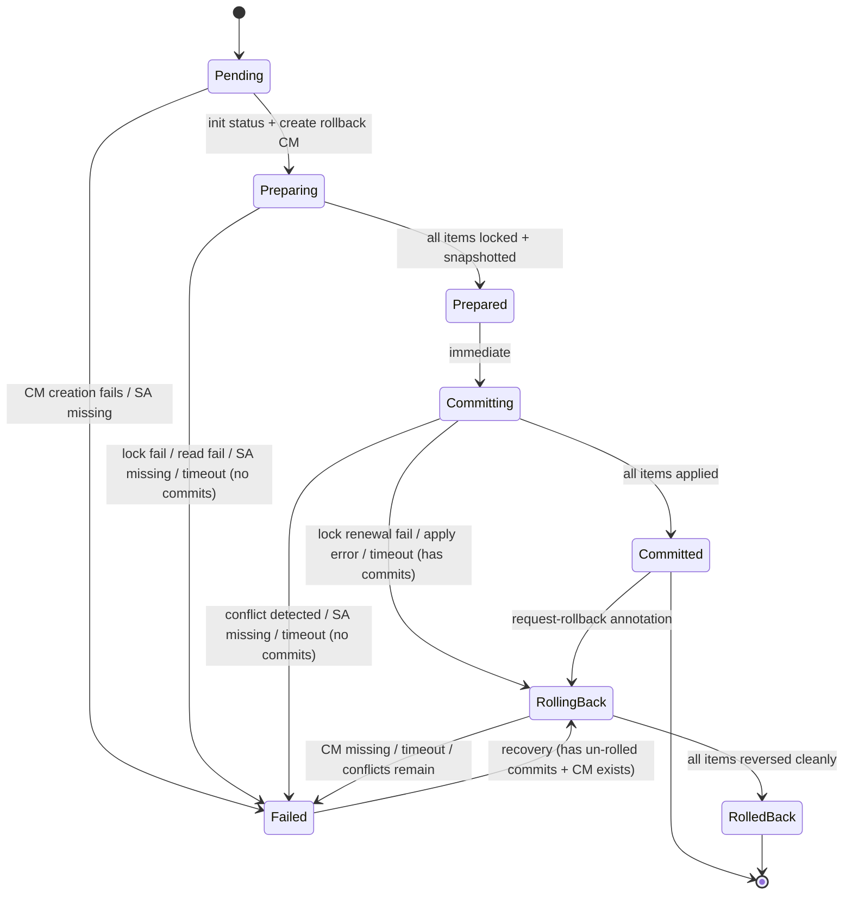

# Design

Architecture, state machine, and implementation details for Janus.

See also: **[Invariants](INVARIANTS.md)** — safety, liveness, and boundary
guarantees.

## Background

### Kubernetes' design philosophy

> [!NOTE]
> [Kubernetes deliberately does not support atomic transactions across multiple
> resources](https://github.com/kubernetes/design-proposals-archive/blob/main/architecture/architecture.md).
> This is an intentional design decision, not a limitation to be fixed. The
> [architecture principles](https://github.com/kubernetes/design-proposals-archive/blob/main/architecture/principles.md)
> explicitly state that atomic enforcement of invariants is "contention-prone
> and doesn't provide a recovery path in the case of a bug allowing the
> invariant to be violated."
>
> Instead, Kubernetes favors:
> - **Eventual consistency** through level-based controllers that continuously
>   reconcile actual state toward desired state
> - **Decoupled components** coordinating via a shared API rather than
>   distributed transactions
> - **Independent resource operations** where each API write commits
>   independently to etcd
>
> This design maximizes system resilience, extensibility, and horizontal
> scalability. It works well for the vast majority of Kubernetes use cases.

Janus extends Kubernetes where coordinated multi-resource changes are needed.
It does not replace or contradict Kubernetes' design — it adds an optional
coordination layer that operates within Kubernetes' eventual consistency model.
Janus reduces the inconsistency window and provides rollback capability, but
it cannot enforce isolation or prevent concurrent writes from non-cooperating
actors. If your use case tolerates uncoordinated eventual consistency (and most
do), standard Kubernetes primitives are the right tool.

### Why the Saga pattern

The [Saga pattern](https://dl.acm.org/doi/10.1145/38714.38742) (Garcia-Molina
& Salem, 1987) decomposes a long-lived transaction into a sequence of
sub-transactions, each paired with a compensating action. If the sequence
aborts at step *n*, the compensating actions for steps *n-1* through *1* are
executed in reverse order.

This fits Kubernetes resource mutations well:

| Forward action | Compensating action |
|---|---|
| Create resource | Delete the created resource |
| Update resource | Restore prior state |
| Patch resource | Restore prior state |
| Delete resource | Re-create from stored state |

Unlike two-phase commit, Sagas do not require participants to hold locks across
the prepare-commit boundary. Each sub-transaction commits independently, and
compensation is applied after the fact. This aligns with Kubernetes's
eventually-consistent, reconciliation-driven model.

### Why Lease-based locking

Kubernetes Lease objects (`coordination.k8s.io/v1`) provide a built-in
mechanism for advisory locking with expiration. Janus acquires a Lease per
resource before mutation and releases it on completion. If the controller
crashes, leases expire after `spec.lockTimeout` (default 5 minutes), unblocking
other transactions.

Leases are advisory — they prevent concurrent *Janus transactions* from
conflicting but do not block direct API writes. This is a deliberate trade-off:
enforced locking would require admission webhooks that intercept all writes to
any potentially transacted resource, adding latency and operational complexity
disproportionate to the benefit.

## CRDs

**Transaction** — orchestrator CR. Key spec fields: `serviceAccountName`,
`sealed`, `lockTimeout`, `timeout`. Status tracks `phase`,
`version` (stale-write detection), `items[]` (per-resource progress),
`rollbackRef` (ConfigMap name).

**ResourceChange** — individual mutation. Key spec fields: `target`
(apiVersion/kind/name/namespace), `type` (Create|Update|Patch|Delete),
`content` (manifest/patch JSON), `order` (execution sequence). Grouped
under Transaction via OwnerReferences; sorted by `(spec.order, name)`.

Each mutation type maps to a Kubernetes API call:

| Type | API call | Notes |
|---|---|---|
| `Create` | `client.Create()` | Full resource manifest in `content` |
| `Update` | `client.Update()` | Full resource manifest; fetches current `resourceVersion` first |
| `Patch` | Server-side apply | Field manager `janus-{txnName}`; coexists with HPA and other controllers |
| `Delete` | `client.Delete()` | `content` ignored; idempotent if resource already gone |

## State machine



**Prepare phase** — For each resource: acquire a Lease lock, read current
state into a rollback ConfigMap. This builds the compensating actions the
Saga needs if it must abort.

**Commit phase** — For each resource: verify the lock is still held, apply
the mutation. If any step fails, the Saga reverses through committed items
in reverse order, restoring each from the rollback ConfigMap.

One item is processed per reconcile cycle. Progress is persisted to the API
server after each item, so the controller can resume from where it left off
after a crash.

## Reconciliation loop

The controller processes **one item per reconcile cycle**. After mutating a
single resource and updating `status.items[]`, it requeues. This ensures every
state transition is persisted to the API server before the next step begins —
a crash at any point can be recovered by re-reading status.

```
reconcile()
  │
  ├─ phase == Pending
  │    create rollback ConfigMap (OwnerRef → Transaction)
  │    init status.items[]
  │    phase → Preparing
  │    requeue
  │
  ├─ phase == Preparing
  │    find first item where prepared == false
  │    acquire Lease lock
  │    read current resource state → rollback ConfigMap
  │    mark item prepared
  │    requeue (or phase → Prepared if all done)
  │
  ├─ phase == Prepared
  │    phase → Committing
  │    requeue
  │
  ├─ phase == Committing
  │    find first item where committed == false
  │    renew lock (extends TTL for this item)
  │    apply mutation
  │    ├─ success: mark item committed, requeue
  │    └─ failure: phase → RollingBack, requeue
  │    (if all done: release locks, phase → Committed; rollback CM preserved)
  │
  ├─ phase == RollingBack
  │    iterate items in reverse
  │    find first committed && !rolledBack item
  │    restore from rollback ConfigMap
  │    ├─ success: mark item rolledBack, requeue
  │    └─ failure: return error (controller-runtime retries with backoff)
  │    (if all done: release locks, phase → RolledBack)
  │    (if rollback CM missing: phase → Failed)
  │
  ├─ phase == Failed
  │    if un-rolled-back commits exist and rollback CM present:
  │      phase → RollingBack (automatic recovery)
  │    else: strip finalizer, terminal
  │
  └─ phase ∈ {Committed, RolledBack}
       strip finalizer, terminal — no further reconciliation
```

## Lock manager

Locks are Kubernetes Lease objects in the **target resource's** namespace, named
deterministically: `janus-lock-{namespace}-{kind}-{name}` (lowercased).

```
Acquire(key, txnName, timeout)
  │
  ├─ Lease does not exist → create with holder = txnName
  ├─ Lease held by txnName → renew (update renewTime)
  ├─ Lease held by other, not expired → ErrAlreadyLocked
  └─ Lease held by other, expired → force-acquire (update holder + times)

Renew(lease, txnName, timeout)
  │
  ├─ Lease not found → ErrLockExpired
  ├─ Lease held by different txn → ErrAlreadyLocked
  ├─ Lease held by txnName but expired → ErrLockExpired
  └─ Lease held by txnName and valid → update renewTime + duration

Release(lease)
  └─ delete Lease (idempotent if already gone)

ReleaseAll(leases)
  └─ release each lease, return first error encountered
```

Labels on each Lease (`app.kubernetes.io/managed-by: janus`,
`janus.io/transaction: {txnName}`) enable identification. Bulk release
iterates the lease refs stored in `status.items[]`.

## Rollback storage

Prior resource state is stored in a ConfigMap named `{txnName}-rollback`,
owned by the Transaction via OwnerReference (garbage-collected when the
Transaction is deleted).

| Key format | Value |
|---|---|
| `{Kind}_{Namespace}_{Name}` | JSON-serialized resource object |

Keys use underscores as separators — Kubernetes resource names (DNS-1123)
and Kind values never contain underscores, so the format is collision-free.

During rollback, stored objects are cleaned of server-set metadata
(`resourceVersion`, `uid`, `creationTimestamp`, `generation`, `managedFields`,
`status`) before re-creation or update. OwnerReferences and finalizers are
preserved — they were part of the original resource state and are needed to
maintain GC chains and external controller contracts.

The ConfigMap is preserved on successful commit (available for `request-rollback`)
and on rollback or failure (available for recovery). It is garbage-collected via
OwnerReference when the Transaction is deleted.

## ServiceAccount impersonation

Resource operations (reads during prepare, mutations during commit, restores
during rollback) execute under the identity of the ServiceAccount named in
`spec.serviceAccountName`. The controller impersonates this SA via the
Kubernetes impersonation API, so the SA's RBAC bindings determine what
resources the transaction can touch. If the SA lacks permission for a
particular operation, the transaction fails cleanly during commit — and any
already-committed items are rolled back.

Impersonating clients are cached per `namespace/saName` pair with lazy
initialization (`sync.Once`). The cache is self-healing: entries are evicted
when SA validation fails (SA deleted or not found), and a fresh client is
created on the next transaction that uses that SA.

## Finalizer

Every Transaction gets a `tx.janus.io/lease-cleanup` finalizer before
any work begins. This ensures that if a Transaction is deleted while leases
are held, the controller gets a chance to release them. The finalizer is
stripped once the Transaction reaches a terminal phase (Committed, RolledBack,
or Failed) so that subsequent deletes are instant.

Deleting a Transaction during an active phase (Preparing, Committing) triggers
rollback of any committed changes if the `automatic-rollback` annotation is
present (it is by default). If the annotation has been removed, the
`rollback-protection` finalizer blocks deletion until the user manually
removes it — preventing silent data loss.

## Annotations & finalizers

- `tx.janus.io/automatic-rollback` — present by default; remove to skip rollback on Transaction deletion
- `tx.janus.io/retry-rollback` — one-shot trigger for Failed transactions; controller removes after attempt
- `tx.janus.io/request-rollback` — one-shot trigger for Committed transactions; controller removes and transitions to RollingBack
- `tx.janus.io/lease-cleanup` — controller-managed finalizer; stripped in terminal states
- `tx.janus.io/rollback-protection` — controller adds, never removes; user strips to allow deletion

## Metrics

The controller registers Prometheus metrics on the controller-runtime
metrics registry:

| Metric | Type | Labels | Description |
|---|---|---|---|
| `janus_transaction_phase_transitions_total` | Counter | `from_phase`, `to_phase` | State machine edge traversals |
| `janus_transaction_duration_seconds` | Histogram | `outcome` | Wall-clock time from start to terminal phase |
| `janus_transactions_active` | Gauge | `phase` | In-flight transactions per non-terminal phase |
| `janus_item_operations_total` | Counter | `operation`, `result` | Per-item prepare/commit/rollback outcomes |
| `janus_lock_operations_total` | Counter | `operation`, `result` | Lock acquire/renew/release outcomes |
| `janus_transaction_item_count` | Histogram | — | Distribution of items per transaction |

## Webhooks

Two validating webhooks (no mutating):
- **Transaction** — cannot unseal; spec immutable once sealed or non-Pending
- **ResourceChange** — target fields required; content required for Create/Update/Patch, forbidden for Delete

## Package map

| Package | Key Types | Purpose |
|---------|-----------|---------|
| `api/v1alpha1/` | Transaction, ResourceChange, ItemStatus | CRD definitions + webhook validators |
| `internal/controller/` | TransactionReconciler | State machine, orchestration |
| `internal/controller/errors.go` | ResourceOpError, RollbackDataError, ErrConflictDetected, ErrRollbackConflict | Typed errors at boundaries |
| `internal/lock/` | Manager (interface), LeaseManager | Advisory locking; ErrAlreadyLocked, ErrLockExpired |
| `internal/impersonate/` | NewClient | SA impersonation client factory |
| `internal/rollback/` | Envelope, Meta | Rollback ConfigMap schema |
| `internal/recover/` | Plan, PlanItem, ApplyItem | Offline recovery CLI logic |
| `internal/metrics/` | (counters, histograms, gauges) | Prometheus metrics |
| `internal/scheme/` | Scheme | Kubernetes scheme with CRDs registered |
| `cmd/controller/` | main | Controller manager entry point |
| `cmd/janus/` | main | CLI: `janus create\|add\|seal\|recover` |
